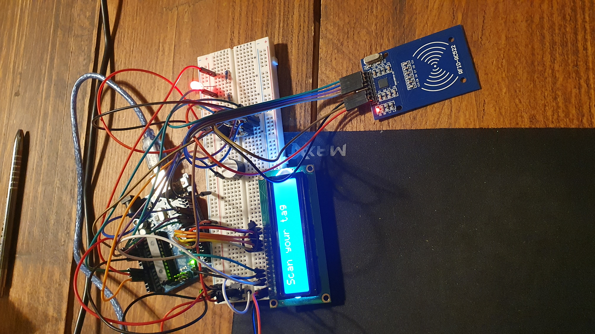

<h3><strong>Schemat działania:</strong></h3>
1. moduł został uruchomiony
2. ustawiony jest na nim stan inicjalizacyjny - initialState();
3. prorgram działa w pętli, co sekunde sprawdza tagDetected(), czyli czy pojawiła się w zasięgu działania czytnika
nowa karta, jeżeli się pojawiłą odczytuje jej UID jeżeli taki UID istnieje istnieje
4. jeżeli karta jest nowa oraz UID istnieje uruchamiany jest beeper na 1000ms oraz na lcd wyświetla się 
"Authorizing..." przez 1000ms
5. kod UID odczytany z karty zostaje wysłany na port szeregowy - sendDataToServer();
6. aplikacja JAVA odbiera dane z portu szeregowego przetwarza je i zwraca Stringa spowrotem na port szeregowy
7. Zwracany z JAVY String to Imię Nazwisko ( albo Hello Kowalski, możesz wejsć ) albo Unauthorized
8. Arduino odbiera bajty z portu szeregowego jeżeli istnieją (czeka na to 2000ms)
9. jeżeli po tym czasie nie ma żadnych bajtów w porcie wyświetlane jest na LCD info NO_MESSAGE_RECEIVED
10. jeżeli jakieś bajty są, przetwarzane są one na Stringa i wyświetlane na LCD
11. Jeżeli String != "Unauthorized" to zapala się LED ZIELONY na 5000ms.
